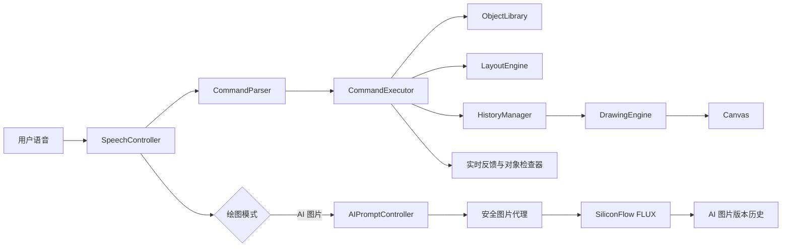

# VoiceCanvas AI 设计文档

## 1. 项目目标

VoiceCanvas AI 的目标是在两天内完成一个稳定、完整、可演示的纯语音绘图 MVP。用户仅需点击按钮授权麦克风，之后所有绘图创作和编辑操作都通过中文语音完成。

项目重点不是穷举固定场景或生成写实图片，而是验证一种清晰的新交互：**通过关键词识别、素材库和自动布局，把自然语言转化为可解释、可撤销、可组合、可继续编辑的智能矢量插画对象。**

## 2. 用户场景

- 用户双手被占用时，通过声音快速画出示意图。
- 低龄用户或不熟悉专业绘图软件的用户，用自然语言完成创作。
- 课堂演示中，通过语音即时展示“自然语言 → 结构化指令 → 图形”的完整链路。
- 无障碍交互探索：减少绘图操作对鼠标精确控制的依赖。

## 3. 为什么选择 MVP 矢量语音绘图，而不是完整 Diffusion AI 绘图

Diffusion 模型需要后端推理、模型服务、GPU、请求排队和更多异常处理。两天周期内接入后，演示稳定性、响应速度和可解释性都存在较大风险。

Canvas 矢量绘图可以在浏览器本地即时执行，响应稳定，操作结果可预测；每条指令还能展示结构化解析结果，便于评审观察开发逻辑和代码质量。因此本项目选择更聚焦、可完成、可验证的 MVP。

## 4. 系统架构

界面层采用 React + TypeScript + Tailwind CSS，数据流保持单向：语音控制器只产出文本；解析器只产出结构化指令；执行器将指令转换为操作组；历史管理器保存操作组快照；绘图引擎只负责渲染。React 状态驱动语音反馈、历史树、对象检查器和九宫格显隐。

## 5. 模块说明

| 模块 | 职责 |
| --- | --- |
| `App.tsx` | 应用状态机、模块装配、语音状态与执行流程协调 |
| `components/MainLayout.tsx` | 全屏主工作区与 320px 右侧控制台布局 |
| `components/VoiceCanvas.tsx` | 自适应 Canvas 与 3×3 语音定位网格 |
| `components/VoiceFeedbackBar.tsx` | idle/listening/processing/executing/error 状态反馈 |
| `components/ControlSidebar.tsx` | 指令历史树、对象图层和意图监视器 |
| `speechController.js` | 封装 Web Speech API、连续监听和错误回调 |
| `commandParser.js` | 中文同义词、数字、参数和指令类型解析 |
| `commandExecutor.js` | 补全默认参数、生成场景对象、执行最后对象编辑 |
| `drawingEngine.js` | 使用 Canvas API 渲染操作、导出 PNG |
| `historyManager.js` | 操作组快照、撤销、重做和清空历史 |
| `sceneFactory.js` | 夜晚城市、星空、日落、森林和机器人场景模板 |
| `styleSystem.js` | 默认、霓虹、极简、手绘、柔和风格配置 |
| `objectLibrary.js` | 素材关键词、场景默认映射及可识别矢量小插画绘制 |
| `layoutEngine.js` | 按背景、远景、主体和点缀分层自动安排对象位置 |
| `aiPromptController.js` | 识别 AI 模式控制指令并累计待生成提示词 |
| `aiHistoryManager.js` | 独立维护 AI 图片版本、撤销与重做 |
| `server/aiProvider.js` | 调用 SiliconFlow、映射错误并签名图片代理地址 |

## 5.1 双模式与安全代理设计

Canvas 与 AI 图片模式共享语音入口和反馈栏，但执行链完全分离。Canvas 指令进入规则解析器与矢量执行器；AI 模式的普通语音只追加提示词，只有“开始生成”才发起图片请求。两种模式分别维护历史，切换模式不会破坏另一模式作品。

AI API Key 只由本地 Vite 中间件或 Vercel Serverless Function 读取。生成接口返回带短期签名的图片代理地址，前端立即下载成会话内 Blob，避免暴露密钥和依赖上游临时链接。

## 6. 计划支持的指令能力

- 基础图形：线、圆、矩形、三角形。
- 精确参数：颜色、坐标、半径、宽高、方向、线宽。
- 编辑能力：清空、撤销、重做、保存。
- 复杂图形：房子、笑脸、太阳。
- 容错能力：同义词、不完整指令、中文数字、默认参数。
- 可观测性：原始文本、结构化指令、执行结果、响应耗时、日志。

## 7. 最终实现的指令能力

最终实现覆盖基础图形、固定高质量场景，以及组合式自然语言绘图。系统可识别季节、时间、天气、校园、公园、海边、城市、森林、太空和湖边等上下文，并组合三十余种素材。支持默认、霓虹、极简、手绘、柔和、儿童画、水彩和像素风格，以及最后对象编辑、追加绘制和全局色调调整。

此外，清空操作也会进入历史快照，可以通过撤销恢复；复杂图形作为一个操作组保存，可以一次撤销。

## 8. 指令解析与容错设计

解析器采用规则化流水线：

1. 清理标点并保留数字间隔。
2. 优先识别清空、撤销、重做、保存等高确定性操作。
3. 识别画笔设置和复杂图形。
4. 匹配颜色与形状同义词。
5. 根据形状提取坐标、半径、宽高、大小和方向。
6. 缺失参数由执行器补全默认值。

无法解析时返回 `{ valid: false, message }`，执行器不会抛出异常，UI 会显示友好提示。线宽限制在 1 到 30 之间，避免异常输入影响画布。

## 9. 响应延迟设计

响应耗时使用 `performance.now()` 统计，从收到浏览器最终识别文本开始，到规则解析和指令执行完成为止。这个指标可衡量项目自身处理性能，不包含 Web Speech API 等待语音服务返回结果的时间。

规则解析和 Canvas 绘制均在本地完成，通常执行非常快。但浏览器语音识别返回时机受浏览器、网络和语音停顿影响，无法保证端到端响应在 200ms 以内。

## 10. 复杂指令拆解设计

复杂指令由执行器拆解为基础操作数组：

- 房子：墙体矩形、屋顶三角形、门矩形、两个窗户矩形。
- 笑脸：脸部圆形、两个眼睛圆形、嘴部圆弧。
- 太阳：主体圆形和十二条射线。

拆解后的数组作为一个 `group` 加入 `HistoryManager`。历史管理器以操作组为最小撤销单位，因此“撤销”会一次移除完整复杂图形，而不是只移除其中一条线。

## 10.1 为什么采用智能矢量插画，而不是真实 Diffusion 生成图

智能矢量插画在浏览器中即时生成，不需要 GPU、后端或收费 API。相比真实 Diffusion，它的结果可预测、对象可编辑、历史可撤销、响应稳定，也更适合两天课程作品的演示要求。场景模板仍能体现自然语言规划和“生成感”，同时保持代码逻辑可解释。

## 10.2 场景模板拆解设计

- 夜晚城市：夜空渐变、月亮、星点、高楼、亮灯窗户、道路。
- 宇宙星空：黑紫渐变、大量星点、行星、流星、山丘剪影。
- 海边日落：暖色天空、夕阳、海平面、随机波浪、沙滩、椰子树。
- 森林：天空、山丘、草地、云朵、随机树木。
- 机器人：圆角身体、头部、眼睛、表情、天线、四肢。

每个场景模板生成一个操作组。组内对象可以独立检查，但撤销和重做以整个场景为单位。

## 10.3 风格系统设计

风格配置集中在 `styleSystem.js`，包含名称、调色板、背景渐变、默认线宽、透明度、发光强度和手绘偏移。对象创建时会将当前风格参数固化到对象记录，后续切换风格不会意外改变已经完成的作品。

## 10.4 对象记录与图层管理设计

每个对象至少保存 `id`、`type`、`label`、`x`、`y`、尺寸参数、`color`、`style` 和 `createdAt`。当前对象数组由历史操作组派生，是画布渲染和右侧对象检查器的唯一数据源。

“编辑最后一个对象”不会直接修改旧快照，而是创建新的历史快照，因此复制、删除、缩放、移动和变色都可以被撤销和重做。

## 10.5 随机细节生成设计

场景生成时使用随机位置、高度、大小、透明度和亮灯状态增强插画细节。随机值只在创建对象时计算一次，并写入对象记录；`DrawingEngine` 重绘时只读取保存值，因此刷新画布、撤销和重做都不会导致细节跳变。

## 10.6 组合式自然语言绘图设计

本项目不以穷举固定场景为目标。解析器会从自然语言中并行提取：

- 场景：校园、公园、海边、城市、森林、太空、湖边、季节等。
- 时间与天气：白天、夜晚、日落、雨天、雪天。
- 风格：霓虹、极简、手绘、柔和、儿童画、水彩、像素。
- 素材对象：太阳、月亮、云、树、花、河流、教学楼、人物、车辆、气球等。

解析结果是结构化 `composeScene` 指令。用户明确提到的对象优先保留，场景预设只补充合理的默认环境素材。

## 10.7 素材库与自动布局设计

`objectLibrary.js` 统一管理素材名称、中文别名、默认数量、视觉层级和 Canvas 绘制方法。每个素材不是单一几何图形，而是由多个路径组合成具有辨识度的小插画。

`layoutEngine.js` 将背景类元素放在最底层、远景放在后面、主体放在中间、点缀放在前景。同类素材会生成多个带稳定随机参数的对象。绘图引擎根据对象的 `layer` 统一排序渲染。

## 10.8 追加绘制与全局调整设计

“再加一些花和气球”会生成新的素材操作组并追加到当前画面；“让画面更丰富一点”根据当前场景选择合理点缀。亮暗冷暖通过可撤销的覆盖滤镜对象实现。风格切换会更新当前对象的调色板、线宽、透明度和发光参数。

## 11. 代码架构与质量说明

- 使用 ES Module 拆分职责，避免全局变量和单文件堆积。
- 使用 React + TypeScript 构建可预测的状态驱动界面，Tailwind CSS 管理响应式视觉系统。
- 语音反馈栏完整覆盖待命、监听、理解、执行和错误五种状态，错误状态两秒后自动恢复。
- 右侧控制台完全从真实历史操作组派生，不使用静态图层数据。
- 解析器与绘图引擎解耦，便于独立测试和后续扩展。
- 使用统一操作数据结构描述图形，重绘和历史恢复逻辑简单可控。
- 历史管理器使用不可变快照思路，撤销/重做行为清晰。
- React 默认转义语音文本与对象标签，避免将识别内容直接作为 HTML。
- 对浏览器兼容性、麦克风错误、未知指令和历史边界提供明确反馈。

## 12. 未完成部分及原因说明

- 已通过安全代理接入托管的 FLUX 图片生成服务，但暂未本地部署 Diffusion / ControlNet，也未实现真实局部重绘。
- 暂未实现真正的 LLM Agent 多轮语义规划，因为本项目优先保证本地可运行和演示稳定性。
- 浏览器语音识别依赖 Web Speech API，不同浏览器兼容性不同。
- 响应延迟受浏览器语音识别返回时机影响，无法保证 200ms 以内。
- 目前复杂指令采用规则化拆解，未来可接入大模型实现更自由的创作能力。
- 暂未实现真正的自然语言任意图像生成，场景目前由稳定模板拆解。
- 暂未实现指定对象的复杂语义编辑，目前优先支持“最后一个图形”。
- 暂不支持任意开放世界物体，素材范围由本地对象库定义。
- 暂不支持复杂语义关系，例如“树后面的房子”。
- 暂不支持真实局部重绘。
- AI 图片模式的修改采用合并提示词后重新生成整张图片，无法保证人物与构图完全保持一致。
- AI 图片生成依赖网络、硅基流动 API Key 和可用额度；服务异常时保留上一张成功图片。
- AI 图片只保存在当前浏览器会话，暂未接入数据库或云端对象存储。

## 13. 未来扩展方向

- 接入 LLM，将自由描述规划为受约束的绘图操作 JSON。
- 接入 LLM Agent，将更自由的语义规划为受约束的对象操作。
- 接入 Diffusion 模型，将矢量场景作为生成条件扩展视觉表现。
- 增加指定对象、图层选择和更复杂的语义编辑。
- 使用离线语音识别提升隐私性和网络不佳时的稳定性。
- 提供 SVG 导出和作品分享。
- 在稳定后将矢量草图作为 ControlNet 条件，生成更丰富的图像。

## 14. 与评审规则的对应关系

### 作品完整度与创新性（40%）

Voice-first 交互贯穿绘图、编辑和保存完整流程；复杂语音指令拆解、同义词容错和原子撤销体现产品创新性。展示型 UI 和实时反馈提升完成度与演示观感。

### 开发过程与质量（40%）

项目保持解析、场景生成、风格、执行、历史和渲染解耦；具备错误处理、边界限制、结构化指令展示、对象记录和自动测试。建议提交顺序见 README。

### 演示与表达（20%）

页面直接展示自然语言、结构化指令、执行结果和延迟，便于讲清技术链路。`docs/demo-script.md` 提供 2 到 3 分钟演示脚本，覆盖基础能力、创新点和代码架构。
