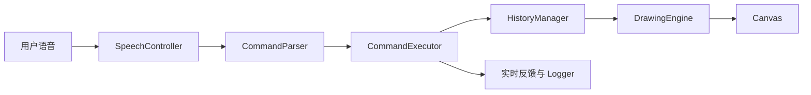

# VoiceCanvas AI 设计文档

## 1. 项目目标

VoiceCanvas AI 的目标是在两天内完成一个稳定、完整、可演示的纯语音绘图 MVP。用户仅需点击按钮授权麦克风，之后所有绘图创作和编辑操作都通过中文语音完成。

项目重点不是生成写实图片，而是验证一种清晰的新交互：**把自然语言转化为可解释、可撤销、可组合的 Canvas 绘图操作。**

## 2. 用户场景

- 用户双手被占用时，通过声音快速画出示意图。
- 低龄用户或不熟悉专业绘图软件的用户，用自然语言完成创作。
- 课堂演示中，通过语音即时展示“自然语言 → 结构化指令 → 图形”的完整链路。
- 无障碍交互探索：减少绘图操作对鼠标精确控制的依赖。

## 3. 为什么选择 MVP 矢量语音绘图，而不是完整 Diffusion AI 绘图

Diffusion 模型需要后端推理、模型服务、GPU、请求排队和更多异常处理。两天周期内接入后，演示稳定性、响应速度和可解释性都存在较大风险。

Canvas 矢量绘图可以在浏览器本地即时执行，响应稳定，操作结果可预测；每条指令还能展示结构化解析结果，便于评审观察开发逻辑和代码质量。因此本项目选择更聚焦、可完成、可验证的 MVP。

## 4. 系统架构

数据流保持单向：语音控制器只产出文本；解析器只产出结构化指令；执行器将指令转换为操作组；历史管理器保存操作组快照；绘图引擎只负责渲染。

## 5. 模块说明

| 模块 | 职责 |
| --- | --- |
| `main.js` | 应用装配、DOM 状态更新、计时与事件协调 |
| `speechController.js` | 封装 Web Speech API、连续监听和错误回调 |
| `commandParser.js` | 中文同义词、数字、参数和指令类型解析 |
| `commandExecutor.js` | 补全默认参数、生成基础/复杂绘图操作 |
| `drawingEngine.js` | 使用 Canvas API 渲染操作、导出 PNG |
| `historyManager.js` | 操作组快照、撤销、重做和清空历史 |
| `logger.js` | 安全渲染操作日志 |

## 6. 计划支持的指令能力

- 基础图形：线、圆、矩形、三角形。
- 精确参数：颜色、坐标、半径、宽高、方向、线宽。
- 编辑能力：清空、撤销、重做、保存。
- 复杂图形：房子、笑脸、太阳。
- 容错能力：同义词、不完整指令、中文数字、默认参数。
- 可观测性：原始文本、结构化指令、执行结果、响应耗时、日志。

## 7. 最终实现的指令能力

最终实现与计划范围一致。基础图形支持默认位置和明确坐标；圆支持半径；矩形支持宽高；线支持横线、竖线、默认斜线和起止坐标；三角形支持颜色和大小。编辑、设置、保存和三种复杂图形均已实现。

此外，清空操作也会进入历史快照，可以通过撤销恢复；复杂图形作为一个操作组保存，可以一次撤销。

## 8. 指令解析与容错设计

解析器采用规则化流水线：

1. 清理标点并保留数字间隔。
2. 优先识别清空、撤销、重做、保存等高确定性操作。
3. 识别画笔设置和复杂图形。
4. 匹配颜色与形状同义词。
5. 根据形状提取坐标、半径、宽高、大小和方向。
6. 缺失参数由执行器补全默认值。

无法解析时返回 `{ valid: false, message }`，执行器不会抛出异常，UI 会显示友好提示。线宽限制在 1 到 30 之间，避免异常输入影响画布。

## 9. 响应延迟设计

响应耗时使用 `performance.now()` 统计，从收到浏览器最终识别文本开始，到规则解析和指令执行完成为止。这个指标可衡量项目自身处理性能，不包含 Web Speech API 等待语音服务返回结果的时间。

规则解析和 Canvas 绘制均在本地完成，通常执行非常快。但浏览器语音识别返回时机受浏览器、网络和语音停顿影响，无法保证端到端响应在 200ms 以内。

## 10. 复杂指令拆解设计

复杂指令由执行器拆解为基础操作数组：

- 房子：墙体矩形、屋顶三角形、门矩形、两个窗户矩形。
- 笑脸：脸部圆形、两个眼睛圆形、嘴部圆弧。
- 太阳：主体圆形和十二条射线。

拆解后的数组作为一个 `group` 加入 `HistoryManager`。历史管理器以操作组为最小撤销单位，因此“撤销”会一次移除完整复杂图形，而不是只移除其中一条线。

## 11. 代码架构与质量说明

- 使用 ES Module 拆分职责，避免全局变量和单文件堆积。
- 解析器与绘图引擎解耦，便于独立测试和后续扩展。
- 使用统一操作数据结构描述图形，重绘和历史恢复逻辑简单可控。
- 历史管理器使用不可变快照思路，撤销/重做行为清晰。
- 日志内容在插入 HTML 前进行转义，避免把识别文本直接作为 HTML。
- 对浏览器兼容性、麦克风错误、未知指令和历史边界提供明确反馈。

## 12. 未完成部分及原因说明

- 暂未接入真正的 Diffusion / ControlNet 图像生成模型，因为两天内完成稳定集成风险较高。
- 暂未实现真正的 LLM Agent 多轮语义规划，因为本项目优先保证本地可运行和演示稳定性。
- 浏览器语音识别依赖 Web Speech API，不同浏览器兼容性不同。
- 响应延迟受浏览器语音识别返回时机影响，无法保证 200ms 以内。
- 目前复杂指令采用规则化拆解，未来可接入大模型实现更自由的创作能力。
- 暂未实现自由曲线、选中单个图形和修改已绘制对象；这些功能需要更复杂的对象选择语义。

## 13. 未来扩展方向

- 接入 LLM，将自由描述规划为受约束的绘图操作 JSON。
- 增加语音询问和确认，实现多轮修改，例如“把刚才的圆变大一点”。
- 为每个对象增加 ID、图层、选中和属性编辑。
- 使用离线语音识别提升隐私性和网络不佳时的稳定性。
- 提供 SVG 导出和作品分享。
- 在稳定后将矢量草图作为 ControlNet 条件，生成更丰富的图像。

## 14. 与评审规则的对应关系

### 作品完整度与创新性（40%）

Voice-first 交互贯穿绘图、编辑和保存完整流程；复杂语音指令拆解、同义词容错和原子撤销体现产品创新性。展示型 UI 和实时反馈提升完成度与演示观感。

### 开发过程与质量（40%）

项目使用七个职责明确的 JavaScript 模块，保持解析、执行、历史和渲染解耦；具备错误处理、边界限制、结构化指令展示和合理的提交规划。建议提交顺序见 README。

### 演示与表达（20%）

页面直接展示自然语言、结构化指令、执行结果和延迟，便于讲清技术链路。`docs/demo-script.md` 提供 2 到 3 分钟演示脚本，覆盖基础能力、创新点和代码架构。
